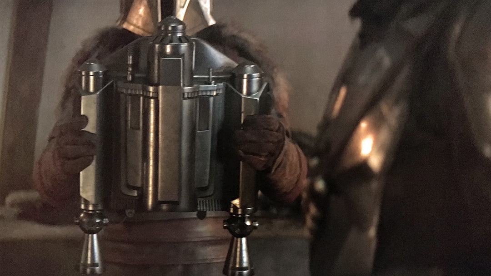
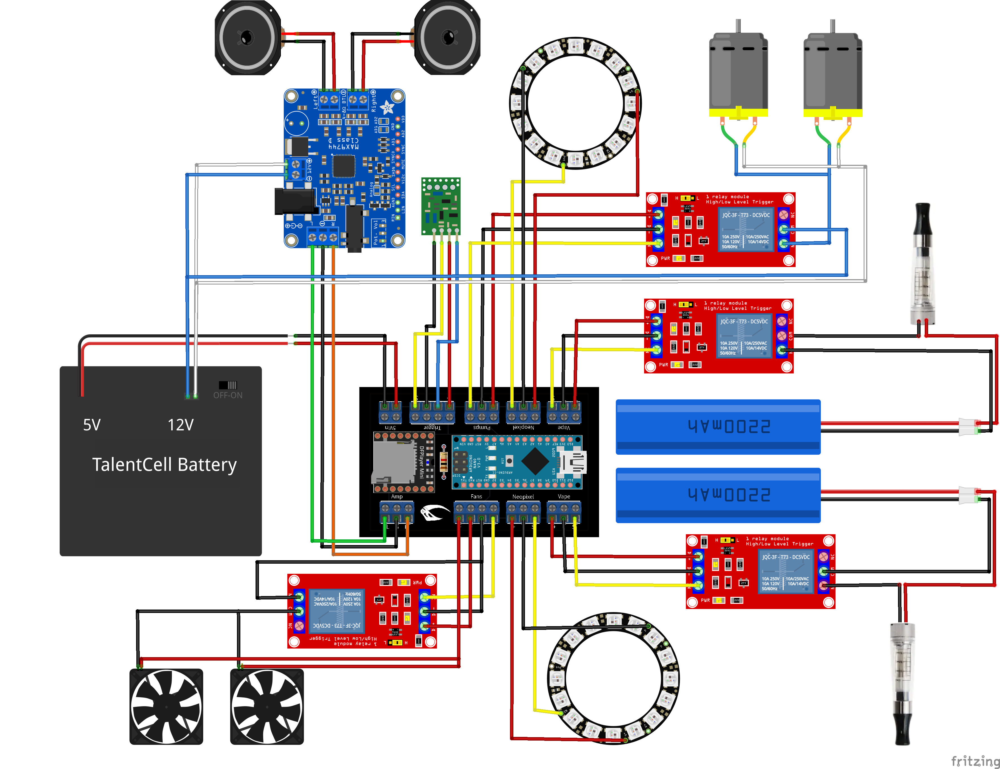
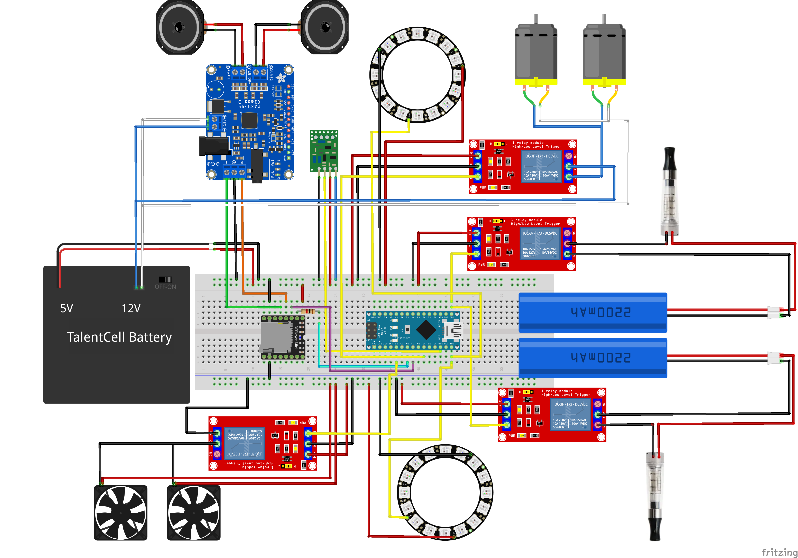

# Arduino [Rising Phoenix](https://starwars.fandom.com/wiki/Rising_Phoenix) Electronics
Open-source electronics project for the Rising Phoenix jetpack worn by Din Djarin in 'The Mandalorian'.

Includes LEDs with flame effect, sound effects, and smoke that is all controlled by a wireless remote.

Video Demo - https://www.youtube.com/shorts/M8bbbQtCOJw

## Parts list
You will need the following parts:
1) [Arduino Nano](https://smile.amazon.com/gp/product/B0713XK923/) - controller for this project.
2) Rising Phoenix board (or blank [prototyping PCBs](https://smile.amazon.com/gp/product/B072Z7Y19F/) and [connectors](https://smile.amazon.com/gp/product/B088LSS14J/)).
3) [DFPlayer Mini](https://www.dfrobot.com/product-1121.html) - get an authentic one made by DFRobot. The knock-offs didn't work in my experience.
4) Micro SD card
5) [1k ohm resistor](https://smile.amazon.com/gp/product/B07QG1V4YL/) - for the DFPlayer's RX pin. (This is included with the Rising Phoenix board.)
6) [12v mini amplifier](https://smile.amazon.com/gp/product/B08GYQTTXF/) - to increase the output of the DFPlayer Mini.
7) (2) [25mm exciters](https://smile.amazon.com/gp/product/B00M292316/) - these stick to the inside of the pack to create the sound.
8) (2) [16 bit Neopixel LED rings](https://smile.amazon.com/gp/product/B08F9HSNSD/) - to place inside the thrusters for the flame effect.
9) (4) [5v relay modules](https://smile.amazon.com/gp/product/B09G6H7JDT/) - to activate the various components.
10) (2) [5v 5015 blower fans](https://smile.amazon.com/gp/product/B07V2KVQB7/) - used to increase airflow of smoke.
11) (2) [12v mini air pumps](https://smile.amazon.com/gp/product/B0786BQYKM/) - used to push air through the vaporizers.
12) (2) ecig vaporizers/atomizers - the Kanger T2 model works best and what this project was designed for but they are getting hard to find.
13) (2) [18650 batteries](https://www.18650batterystore.com/products/molicel-p26a) - need a high current output. These power the vaporizers.
14) [Talentcell 3000 mAh rechargable battery pack](https://smile.amazon.com/gp/product/B01M7Z9Z1N/) - provides both 5v and 12v power to everything except the vaporizers. Will not automatically power off like most USB battery packs.
15) [Wiress RF remote](https://smile.amazon.com/gp/product/B07C9F4VJX/) - to activate the jetpack easily
16) [Silicone Tubing 4mm ID X 6mm OD](https://smile.amazon.com/gp/product/B07V5MX1Q4/)
17) [Silicone Tubing 8mm ID x 11mm OD](https://smile.amazon.com/gp/product/B07V5PKYMK/)
18) [24-22 AWG hookup wire](https://smile.amazon.com/gp/product/B073QHPGMC/)
19) [Wago lever nuts](https://smile.amazon.com/gp/product/B07W4RQ6R6/) - for some of the 12v wire connections

## Wiring Diagram
Using custom Rising Phoenix board

Using prototype board

## Instructions

Detailed instructions coming soon

